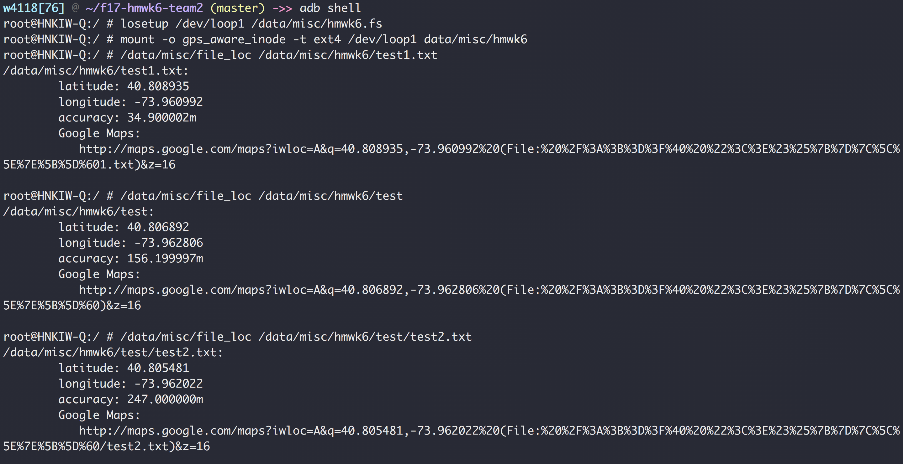

#hmwk6
yz3170 Yufei Zhao
sh     Shijun Hou
hl3069 Han Li

## Structure of hmwk6.fs
/-
 |-test1.txt
 |-test
     |-test2.txt

## Result of file_loc
The result of file_loc for these 1 directory and 2 files is as follow:
```
root@HNKIW-Q:/ # /data/misc/file_loc /data/misc/hmwk6/test1.txt
/data/misc/hmwk6/test1.txt:
	latitude: 40.808935
	longitude: -73.960992
	accuracy: 34.900002m
	Google Maps:
	   http://maps.google.com/maps?iwloc=A&q=40.808935,-73.960992%20(File:%20%2F%3A%3B%3D%3F%40%20%22%3C%3E%23%25%7B%7D%7C%5C%5E%7E%5B%5D%601.txt)&z=16

root@HNKIW-Q:/ # /data/misc/file_loc /data/misc/hmwk6/test
/data/misc/hmwk6/test:
	latitude: 40.806892
	longitude: -73.962806
	accuracy: 156.199997m
	Google Maps:
	   http://maps.google.com/maps?iwloc=A&q=40.806892,-73.962806%20(File:%20%2F%3A%3B%3D%3F%40%20%22%3C%3E%23%25%7B%7D%7C%5C%5E%7E%5B%5D%60)&z=16

root@HNKIW-Q:/ # /data/misc/file_loc /data/misc/hmwk6/test/test2.txt
/data/misc/hmwk6/test/test2.txt:
	latitude: 40.805481
	longitude: -73.962022
	accuracy: 247.000000m
	Google Maps:
	   http://maps.google.com/maps?iwloc=A&q=40.805481,-73.962022%20(File:%20%2F%3A%3B%3D%3F%40%20%22%3C%3E%23%25%7B%7D%7C%5C%5E%7E%5B%5D%60/test2.txt)&z=16
```


## References
